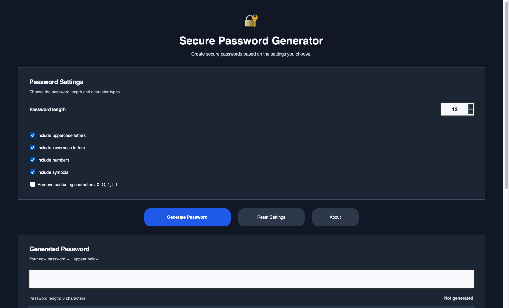
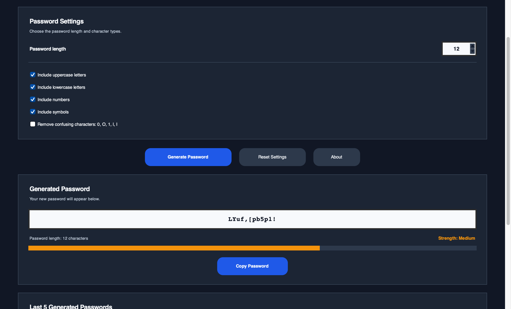
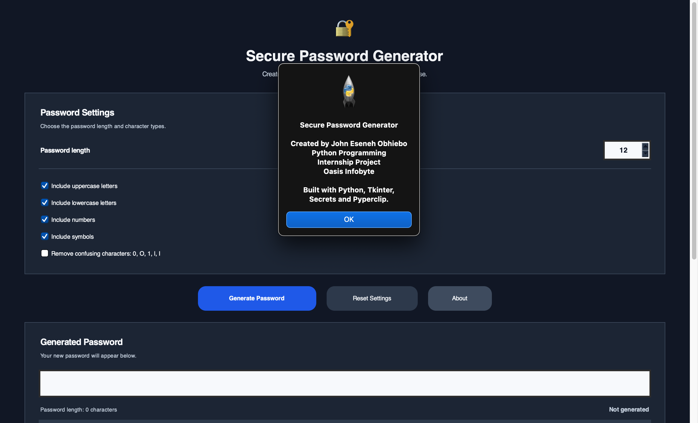
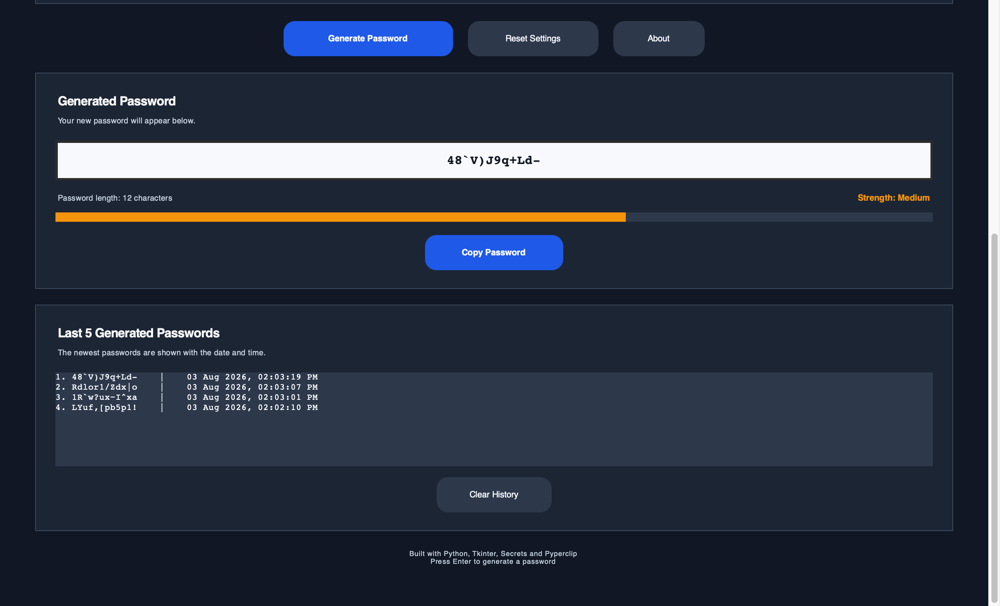

# Random Password Generator

A secure desktop password generator developed for the Oasis Infobyte Python Programming Internship.

## Project Overview

This application generates strong and customizable passwords using Python. Users can choose the password length and character types, then copy the generated password to the clipboard. The application also keeps a history of recently generated passwords.

---

## Technologies Used

- Python
- Tkinter
- Pyperclip
- Secrets

---

## Features

- Adjustable password length
- Uppercase letters
- Lowercase letters
- Numbers
- Symbols
- Secure password generation using the `secrets` module
- Copy password to clipboard
- Password history
- Reset button
- Input validation
- Error handling

---

## Installation

Install the required packages:

```bash
python3 -m pip install -r requirements.txt
```

---

## Run

```bash
python3 password_generator.py
```

---

## Project Structure

```text
Python-Task3-RandomPasswordGenerator/
├── password_generator.py
├── README.md
├── requirements.txt
└── .gitignore
```

---

## Skills Demonstrated

- Python Programming
- GUI Development
- Secure Random Number Generation
- Input Validation
- Desktop Application Development

---

## Author

John Eseneh Obhiebo


---

## Screenshots

### Home Screen



### Generated Password



### Password Options



### Recent Passwords

