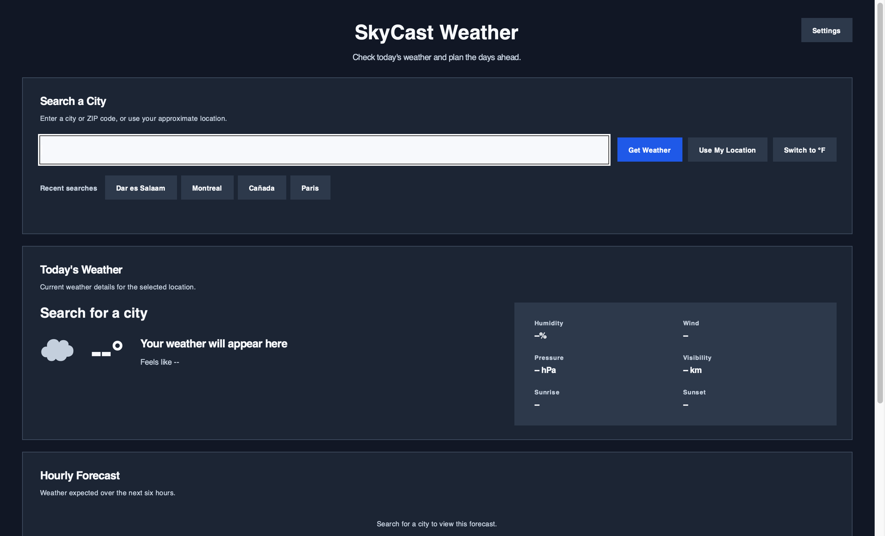
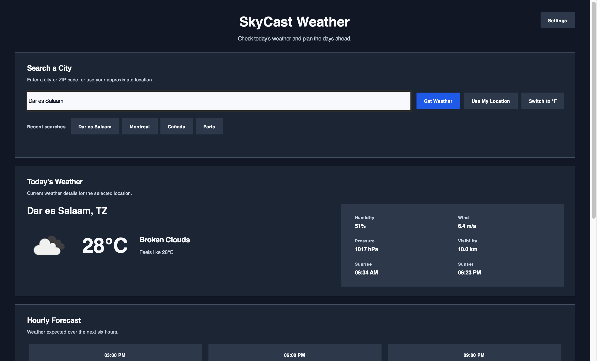
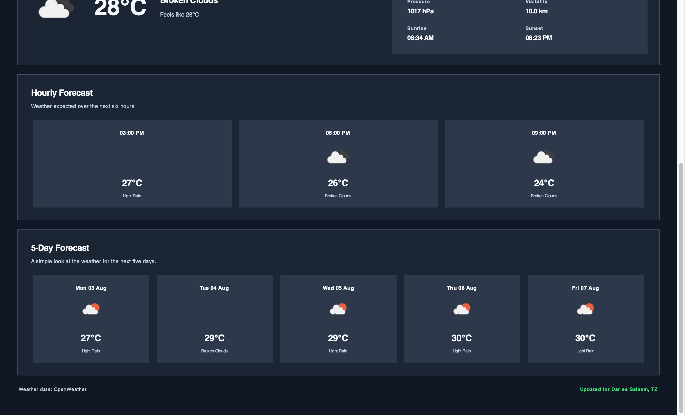
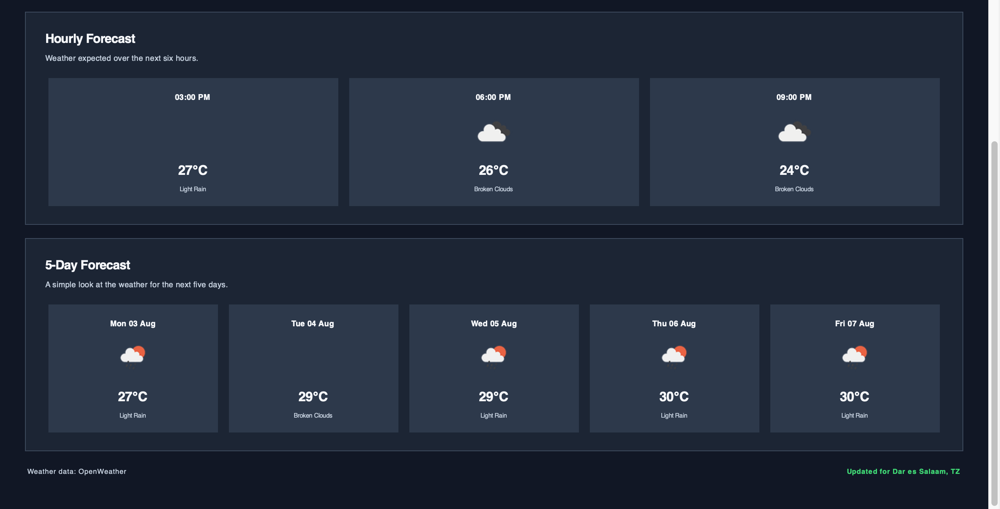

# SkyCast Weather

An advanced desktop weather application developed for the Oasis Infobyte Python Programming Internship.

## Project Overview

SkyCast Weather allows users to search for live weather information by city name or ZIP code. It displays current conditions, an hourly outlook, and a five-day forecast in a responsive Tkinter interface.

The application also supports automatic location detection, recent search history, weather icons, and Celsius or Fahrenheit units.

---

## Technologies Used

- Python
- Tkinter
- Requests
- Pillow
- OpenWeather API
- ipinfo.io

---

## Features

- Search by city name or ZIP code
- Current temperature and weather condition
- Humidity
- Wind speed
- Air pressure
- Visibility
- Sunrise and sunset times
- OpenWeather condition icons
- Hourly forecast for the next six hours
- Five-day weather forecast
- Celsius and Fahrenheit toggle
- Automatic city detection using public IP
- Recent search history
- Scrollable interface
- Mouse and trackpad scrolling
- Background API requests
- GUI error messages
- Invalid API key handling
- City-not-found handling
- Network timeout handling
- Server and rate-limit error handling
- Local API key storage excluded from GitHub

---

## Installation

Install the required packages:

```bash
python3 -m pip install -r requirements.txt
```

---

## API Key Setup

1. Create a free OpenWeather account.
2. Copy your API key.
3. Run the application.
4. Paste the key into the API field.
5. Click **Save Key**.

The API key is stored locally in:

```text
config.json
```

This file is excluded from GitHub.

A newly created OpenWeather API key may require some time before it becomes active.

---

## Run

Activate the virtual environment if one is being used:

```bash
source .venv/bin/activate
```

Run the application:

```bash
python weather_app.py
```

---

## Project Structure

```text
Python-Task4-BasicWeatherApp/
├── weather_app.py
├── README.md
├── requirements.txt
├── config.example.json
└── .gitignore
```

The application may create these local files:

```text
config.json
search_history.json
```

Both should remain excluded from GitHub.

---

## Privacy

- Weather searches are sent to OpenWeather.
- Automatic location detection uses ipinfo.io and the user's public IP address.
- The application does not use precise GPS location.
- The API key and search history remain stored locally.
- No passwords or personal accounts are collected.

---

## Skills  i Demonstrated

- REST API Integration
- JSON Data Processing
- GUI Development
- Multithreading
- Error Handling
- Local Configuration Storage
- Responsive Desktop Interface Design

---

## Author

John Eseneh Obhiebo


---

## Screenshots

### Home Screen



### Current Weather



### Hourly Forecast



### Five-Day Forecast

